# MaskGIT-Edit

## Motivation
A full image synthesis workflow should allow user guidance at all levels of granularity. Text-based user inputs are suitable for coarse-grained control, but pixel-space markings are a more intuitive means for providing spatially precise user guidance. Note that in this regime, a user is typically fine-tuning small patches within a generated image, so our methods should primarily model the conditional generation of only the edited portions of the image.

Supervised tuning of a generative model to allow conditioning on user inputs is expensive as there is no true output matching a given user's edit in general. Fortunately, [SDEdit](https://sde-image-editing.github.io/) provides a proof of concept that clever interfacing with a generative model, without _any_ tuning, can integrate user edits quite well. However, the SDEdit model can only be formulated for diffusion models. User edit semantics are preserved only in so far as a diffusion process tends to not corrupt major edit structure. A diffusion edit method is convenient, but does not satisfy the rapid iteration requirement (for the standard diffusion model format), as the whole image is regenerated for a given edit. A candidate backbone that naturally fits the conditional generation problem is [MaskGIT](https://masked-generative-image-transformer.github.io/), which uses a masked autoencoding Vision Transformer rather than a diffusion process. There is no straightforward diffusion process to directly integrate edits, however, so we discuss how we approach the problem next.

## Approach

The problem formalizes as follows: denote flattened image pixels or patches as $X_{[n]}$, and denote guidance as $G_{E}, E \subset [n]$. Our guided image is thus $X^{(g)} = \{X_{[n]\setminus E}, G_{E}\}$.  Then, we want to use a generative model's pretrained

$$
    p_\theta (X_E | X_{[n] \setminus E})
$$

To model

$$
    p (X_E | X_{[n] \setminus E}, G_E)
$$

SDEdit bridges the gap between the two distributions with forward diffusion: under sufficient noise, $G_E$ is indistinguishable from $X_E$. So they sampled a noised guidance
$
X^{(g)}(t_0) \sim \mathcal{N}(X^{(g)}; \sigma^2 (t_0) I)
$, and then directly apply the pretrained reverse diffusion.
Uncertainty is a great way to fold in user edits and future methods will likely retain the idea; MaskGIT does _not_ pretrain with uncertain inputs, but does let us focus on spatial dependencies. Let's investigate.

First, MaskGIT is a Vector-Quantized Transformer that first encodes image patches into discrete codes. This project, like MaskGIT itself, focuses on the Transformer generative model over code tokens, not pixels. MaskGIT uses beam-search/ancestral sampling to draw from
$p(X_E|X_{[n]\setminus E})$
over
$K$ steps; each step conditions _only on previously sampled tokens_ and locks in the most confident tokens. To be very specific: by default, MaskGIT proposes a sample for a patch, but will discard it if the confidence is below a threshold. MaskGIT by default will "trust" its conditioning because those were all high confidence.

Thus, MaskGIT does not by default condition in $E$ to sample $X_E$. We must either tune the model to do so, or heuristically hack the inference process. We split the conditioning into two pieces: for a particular $X_{j \in E}$, can we use $G_j$ (self-guidance) and $G_{E \setminus j}$ (context-guidance)? We illustrate this in the below figure, and explain our methods with respect to it.

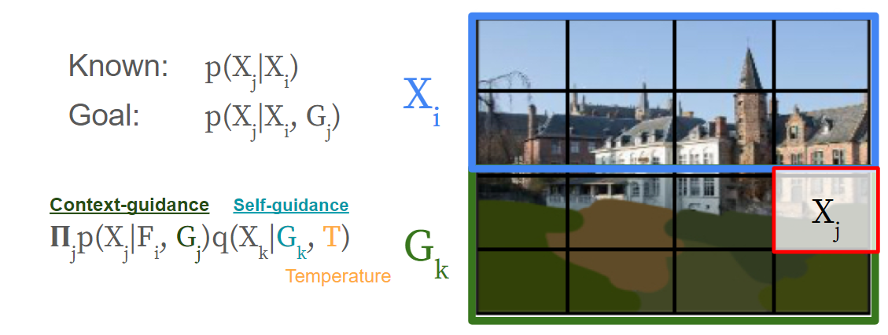

**Non-tuning Heuristics**
- `Context-guidance`: can be applied by manipulating inference. At each step of ancestral sampling, we replace the previous round's least confident samples with guidance. (See `maskgit/libml/parallel_decode.decode_context_guidance`)
- `Self-guidance, fixed`: can reweight sampled confidences via a pre-specified distance metric. I use L2 as a metric. The reweighting can be scaled according to user confidence.

**Tuning**
- `Self-guidance, learned`: by learning a thin reweighting matrix of size $C \times C$ (representing affinities between the $C$ codes), we can attempt to learn self-guidance without worrying about overfit in the Transformer.
- `Iterative generation`: We can also just try to learn the goal function itself. Both forms of guidance might be achieved if the model can be trained to use low confidence samples -- _such as those produced in its own iterative sampling_. I implement this by retaining the low-confidence samplesd tokens from an initial iteration and adding their embedding to another iteration (See `maskgit.nets.maskgit_transformer`). Guidance can then be provided at test-time identically to how it's provided in modified training. In retrospect, it may be possible to accomplish this result zero-shot by ditching the `[MASK]` token mechanism and simply seeing how the model updates the logits for the unrealistic guidance tokens. I did not try this.

I highlight the intuition for why MaskGIT can probably benefit from this tuning using the MaskGIT figure. See how so many of those patches are totally reasonable partial guesses? No need to discard them completely!

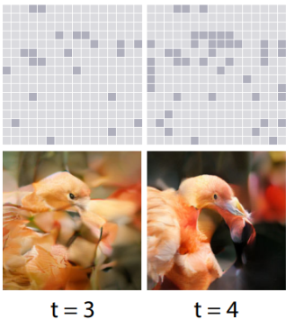

### Implementation Note
We use the open-sourced MaskGIT repo -- unfortunately this only had an inference demo so much effort was directed to setting up a training pipeline. Being in JAX... this killed progress. My end training pipeline kept OOM-ing on my ~10G nodes essentially until a batch size of 1 ([wandb logs](https://wandb.ai/joelye9/maskgit_edit)) which led to very humble fine-tuning efforts.

The open MaskGIT weights are only on ImageNet, so we use those.

## Results

We perform a qualitative evaluation on automatically generated "strokes" using an algorithm similar to that described in SDEdit's auto-stroke generation. We use two settings; "stroke inversion" where a stroke-segmented region is assigned the mean color of pixels in the region, and "stroke counterfactual" where the stroke is assigned a randomly generated color. The other various datasets in SDEdit were difficult to compare with as it was unclear to me how to generate those edited images; moreover the pretrained MaskGIT was only for ImageNet. See `make_strokes.py`.
I experimented with a few of the aforementioned variants:
1. Baseline (no guidance). Should be the most photorealistic.
2. Context guidance only
3. Self-guidance fixed: Identity matrix / Code L2
4. Self-guidance learned: Code L2 init
- We observe in this case that the learned weights does not deviate greatly from the original matrix. For example, an initial distance energy of 8 might change to 8.05. Moreover, identity and code L2 were qualitatively highly similar. Finally, we also note it's very difficult to find a reasonable confidence tuning; I ultimately didn't find this to be useful.
1. Tuned, iterative generation.
<!-- 2. No promises, but if I have time I'll add the direct usage of the pretrained model with the guidance tokens subbed in for mask tokens. -->
We do not compare combinations of self-guidance and context-guidance as context-guidance proves too strong a signal to apply directly, and there is no clear way to titrate its influence. It may have been useful for other types of user guidance, such as nearly realistic strokes anyway (e.g. photoshopped glasses)

We sample 3 ImageNet classes and 1 samples per variant.

Source | No guide | Context |  Self: Learned | Self: Learned, full Conf  | Iterative tuning
|:---:|:---:|:---:|:---:|:---:|:---:
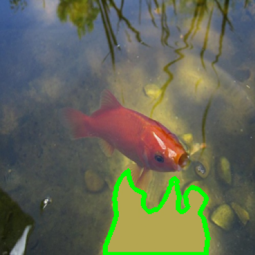 | 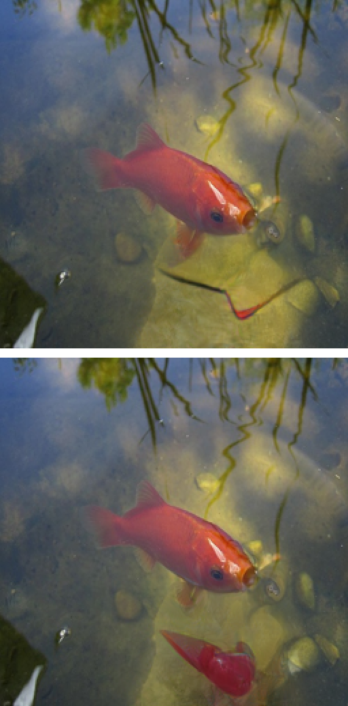 | 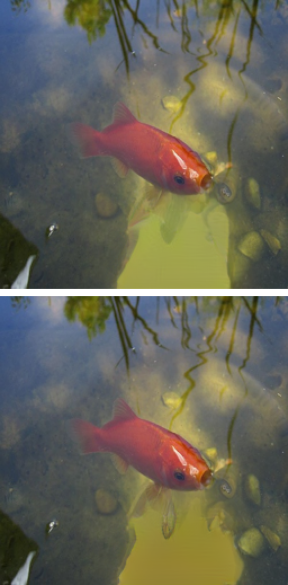 |  | 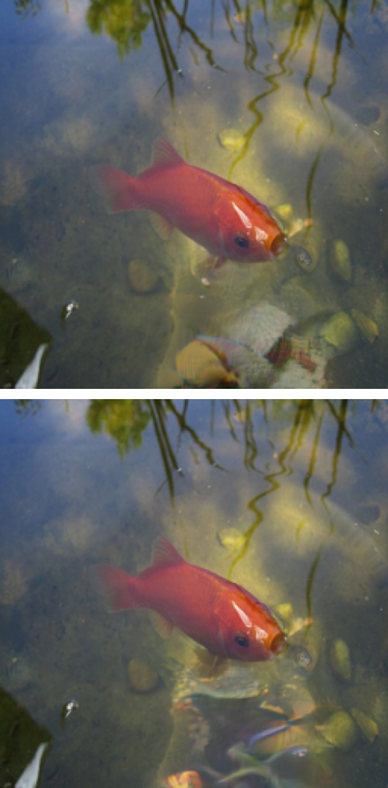 | [iterative](./output/cls_goldfish_iterate_1.png)
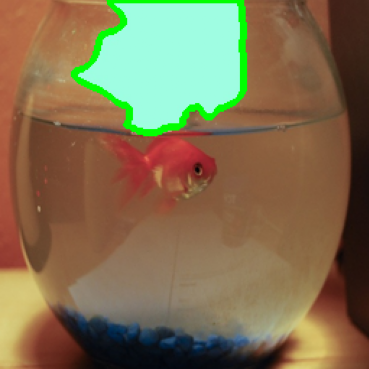 |  |  |  |  | 
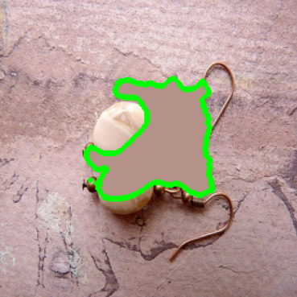 |  |  |  |  | 
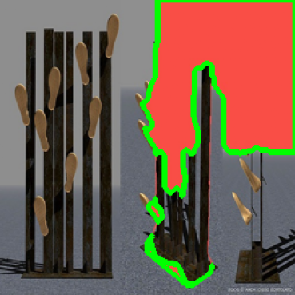 |  |  |  |   
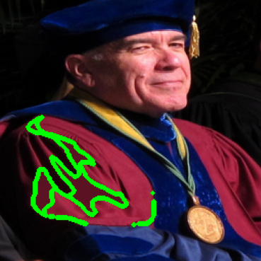 |  |  |  |  
 |  | 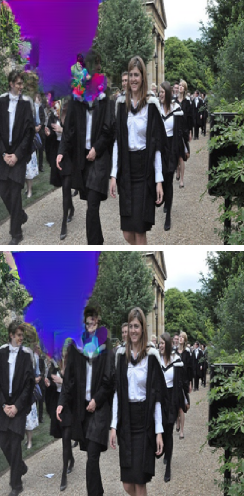 |  | 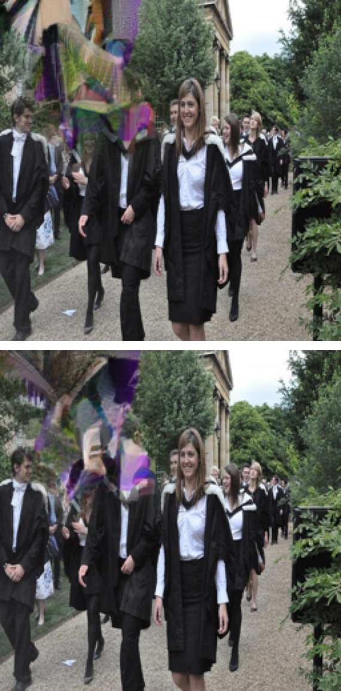  

From here, it's pretty easy to see that the methods that attempted strong guidance produce strange artifacts. Context-guidance is way too prescriptive and actually produces uniform colors without updates. Self-guidance with strong temperatures peer into the abyss of generative model latent space, with fractals and textures but no coherence. In these samples, slightly lower confidence self-guidance and iterative tuning are not visibly different. This is true even with counterfactual guidance.

## Summary
Motivationally, the spatial benefits of MaskGIT are entirely complementary to SDEdit's iterative denoising. Uncertainty is a natural way of trading off fidelity to user guidance with realism. Unlike diffusion models, however, there is no clear way to iteratively integrate guidance in MaskGIT. A promising idea was simply to tune MaskGIT its own low confidence samples to improve future samples. (This would have been great: if we want more realistic samples, simply extend the inference schedule.) However, this did not yield promising results in these pilot explorations. Moreover, attempts to build at intuitive knob failed.